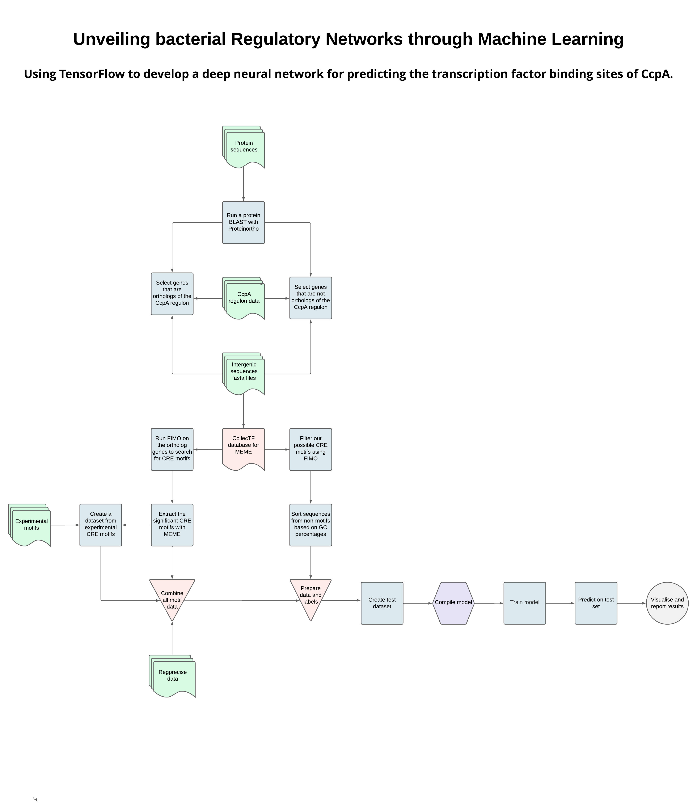

 <!---->

<!-- TABLE OF CONTENTS -->

  
<h2 style="display:inline;"><strong>Table of Contents</strong></h2>

  <ol>
    <li><a href="#about-the-project"><h3>About The Project</h3></a></li>
    <li><a href="#prerequisites"><h3>Prerequisites</h3></a></li>
    <li><a href="#models"><h3>Models</h3></a></li>
    <li><a href="#usage"><h3>Usage</h3></a></li>
    <li><a href="#data-sources"><h3>Data Sources</h3></a></li>
    <li><a href="#workflow"><h3>Workflow</h3></a></li>
    <li><a href="#contact"><h3>Contact</h3></a></li>
    <li><a href="#license"><h3>License</h3></a></li>
  </ol>

<!-- ABOUT THE PROJECT -->

## About The Project

The transcription factor catabolite control protein A (CcpA) is a major regulator of carbon
catabolite repression (CCR) in Gram-positive bacteria. CcpA forms complexes with
HPrSerP or CrhP to modulate gene expression through binding to catabolite-responsive
elements (CRE).

The CRE sequences in *Bacillus subtilis* are semi-palindromic sequences characterized by the consensus
sequences T1G2A3A4A5G6C7G8C9T10T11T12C13A14 and T1G2A3A4A5R 6C7G8Y9T10T11T12C13W14, as illustrated in Figure 1. CRE sequences have low conservation which makes it challenging to accurately detect CRE binding sites
in other organisms. Bidirectional long short-term memory (BiLSTM) models have demonstrated efficacy in various bioinformatics applications. This project focuses on predicting CRE binding sites using BiLSTM.

<!-- prerequisites -->

### Prerequisites

The main software in this project are Bash version 4.2.46 and Python version
3.9.5. Bash uses the tools MEME Suite version 5.5.0 and Proteinortho version 
6.0.29. The Python modules are listed in Table 1. Sometimes it is necessary to use 
different versions for compatibility with TensorFlow on Hábrók.

*Table 1. Python modules*

| Module     | Version | 
|:---------- |:--------|
| Bio        | 1.5.9   |
| keras      | 1.12.0  |
| keras_tuner| 1.3.5   |
| Numpy      | 1.22.4  |
| pandas     | 1.4.2   |
| sklearn    | 0.0.0   |
| Tensorflow | 2.12.0  |

The R modules are shown in Table 2. R was mostly used to preprocess data and to
visualize results.

*Table 2. R modules*

| Module     | Version | 
|:---------- |:--------|
| data.table | 1.13.2  |
| dyplr      | 1.0.2   |
| ggplot2    | 3.4.2   |
| plyr       | 1.8.6   |
| readxl     | 1.3.1   |
| tidyr      | 1.1.2   |
| Tensorflow | 2.12.0  |

Additional programs are MEME version 5.5.2 and Proteinortho version 6.0.14.

<!-- models -->

### Models

During the course of this project, various models were developed and stored in Output/Models. The predominant GC-groups within the dataset were 20-29 and 30-39. The model based on the GC range of 20-29 was tested on the two species *L.lactis* and *C.difficile*, while the model with a GC range of 30-39 was tested on the species *B.subtilis*, *S.suis*, and *S.pneumoniae*. The performances of these models are documented in Table 3.

*Table 3. Model performances*

| Specie        | Accuracy | FDR  | F1 Score | Precision | Recall |
|:------------- |:--------:|:----:|:--------:|:---------:|:------:|
| *B.subtilis*  | 0.97     | 0.84 | 0.25     | 0.16      | 0.56   |
| *C.difficile* | 0.96     | 0.94 | 0.10     | 0.06      | 0.20   |
| *L.lactis*    | 0.97     | 0.79 | 0.30     | 0.21      | 0.52   |
| *S.pneumoniae*| 0.96     | 0.80 | 0.28     | 2.0       | 0.51   |
| *S.suis*      | 0.95     | 0.77 | 0.29     | 0.23      | 0.38   |

<!-- usage -->

### Usage

In order to use the scripts clone the github. The CNN model can be created and 
tested with `Scripts/Bash/test_model.sh`. This command runs the python script Scripts/Python/test_model.py, 
more information about this script can be found in its documentation. 

It is possible to apply the workflow to a different motif. In that case
make sure that the following  directories are adjusted for the correct motif and 
bacterial species; /Data/Protein_sequences /Data/Intergenic_sequences 
/Data/Motifs/Regprecise, /Data/MEME_database/collectf.meme, /Data/Regulons/.
The paths and FIMO parameters in scripts ./Scripts/Bash/pblast_proteinortho.sh
./Scripts/Bash/create_positive_labels.sh and ./Scripts/Bash/filter_intergenic_regions.sh
will also need to be changed.

Positive labels for the CcpA model were created with /Scripts/Bash/create_positive_labels.sh.
This script expects the file motifs.fasta, which it creates with the Rscript 
combine_data.R. If a motif other than CcpA is used, new experimental data will need 
to be gathered into a fasta file and `Scripts/R/combine_data.R` cannot be used. Negative labels
are created with ./Scripts/Bash/filter_intergenic_regions.sh Both scripts require Proteinortho output.

- Order of running scripts:
  1. `/Scripts/Bash/pblast_proteinortho.sh`
  2. `/Scripts/Bash/create_positive_labels.sh`
  3. `./Scripts/Bash/filter_intergenic_regions.sh`

Once the data preprocessing is completed the CNN model can be created.

<!-- data-sources -->

### Data sources

All Fasta files in /Data/Protein_sequences and /Data/Intergenic_sequences were 
downloaded from [Genome2D](http://genome2d.molgenrug.nl/) in Genbank format.

The CRE motifs were extracted from various research papers and sites noted in /Data/motifs.
Additional CRE motifs were downloaded from [CollecTF](http://www.collectf.org/browse/home/) and [PRODORIC](https://www.prodoric.de/). Experimental regulons were also downloaded from CollecTF. Moreover, manually curated inferences of the CcpA regulon were downloaded [RegPrecise](https://regprecise.lbl.gov/search.jsp)
and stored in /Data/Regprecise. 

<!-- workflow -->

### Workflow

<!-- CONTACT -->

## Contact

For questions about the project code

Yaprak Yigit - [y.yigit.1\@student.rug.nl](mailto:y.yigit.1@student.rug.nl)

Project Link: <https://github.com/y-yigit/Placeholder>

<!-- license -->
## License

See LICENSE

(<a href="#readme-top">back to top</a>)

